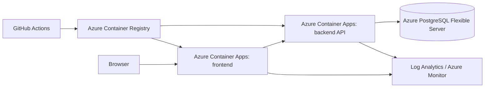

# OpsBoard Architecture

## Objective

OpsBoard is a small incident tracking application for the technical exercise. It proves a complete path from browser UI to backend API to PostgreSQL to deployable Azure infrastructure, while staying small enough to finish in a four-hour window.

Success metrics:

- A reviewer can run it locally with one command.
- The public Azure URL serves the frontend container, which proxies API traffic to the backend container.
- Incident data is persisted in PostgreSQL, not hardcoded into the frontend.
- Health, readiness, logs, metrics, tests, Docker, CI, and deployment scripts are present.
- The README explains tradeoffs, scaling, and incomplete work honestly.

## User Flows

1. View current incidents and operational summary.
2. Create a new incident with title, description, priority, and owner.
3. Filter incidents by status, priority, and search text.
4. Move an incident through open, in progress, and resolved.
5. Inspect `/healthz`, `/readyz`, `/metrics`, and `/openapi.yaml`.

## Azure Runtime

Docker Compose runs PostgreSQL locally and passes `DATABASE_URL` to the backend. The frontend container serves static files with Nginx and proxies API traffic to the backend. Azure deployment provisions Azure Database for PostgreSQL Flexible Server, stores the connection string as a backend Container Apps secret, and passes it to the backend as `DATABASE_URL`.

## Components

- `frontend/`: browser UI built with native HTML, CSS, and JavaScript.
- `frontend/Dockerfile`: Nginx image for the UI and API proxy.
- `frontend/nginx.conf.template`: runtime proxy configuration.
- `backend/Dockerfile`: Node.js API image.
- `backend/src/app.js`: HTTP routing, static serving, API responses, security headers, auth checks, metrics.
- `backend/src/stores/postgres-store.js`: PostgreSQL persistence for Docker and Azure.
- `backend/src/stores/file-store.js`: test and emergency local fallback persistence.
- `backend/migrations/001_create_incidents.sql`: database schema for review and manual migration.
- `docs/api/openapi.yaml`: API contract.
- `backend/load/smoke-load.js`: dependency-free load test.
- `infra/azure/`: Azure deployment scripts.

## Non-Functional Targets

- Performance: p95 API latency under 250 ms for read-heavy load in the exercise environment.
- Availability: one or more Container Apps replicas; health checks allow failed replicas to be replaced.
- Scalability: HTTP autoscale from 1 to 5 replicas, concurrency threshold configurable.
- Security: secure headers, bearer token for writes when `ADMIN_TOKEN` is set, input validation, no secrets in source.
- Recovery: Azure PostgreSQL backup retention is configured during deployment. File mode is not used for the delivered stack.
