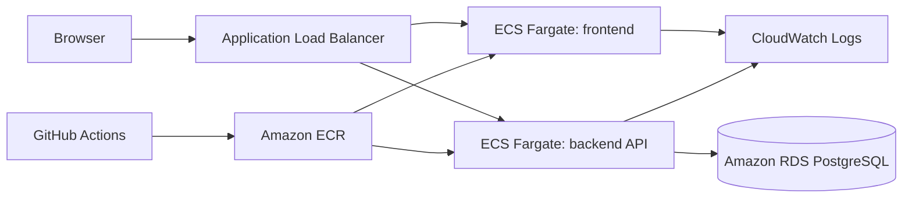

# OpsBoard Architecture

## Objective

OpsBoard is a small incident tracking application for the technical exercise. It proves a complete path from browser UI to backend API to PostgreSQL to deployable AWS infrastructure, while staying small enough to finish in a four-hour window.

Success metrics:

- A reviewer can run it locally with one command.
- The public AWS load balancer URL serves the frontend and routes API traffic to the backend.
- Incident data is persisted in PostgreSQL, not hardcoded into the frontend.
- Health, readiness, logs, metrics, tests, Docker, CI, and deployment scripts are present.
- The README explains tradeoffs, scaling, and incomplete work honestly.

## User Flows

1. View current incidents and operational summary.
2. Create a new incident with title, description, priority, and owner.
3. Filter incidents by status, priority, and search text.
4. Move an incident through open, in progress, and resolved.
5. Inspect `/healthz`, `/readyz`, `/metrics`, and `/openapi.yaml`.

## AWS Runtime

Docker Compose runs PostgreSQL locally and passes `DATABASE_URL` to the backend. The frontend container serves static files with Nginx. In AWS, the Application Load Balancer sends page requests to the frontend service and API/health/metrics requests to the backend service. AWS deployment provisions Amazon RDS for PostgreSQL, stores the connection string as a Secrets Manager secret, and injects it into the backend task as `DATABASE_URL`.

## Components

- `frontend/`: browser UI built with native HTML, CSS, and JavaScript.
- `frontend/Dockerfile`: Nginx image for the UI.
- `frontend/nginx.conf.template`: runtime proxy configuration for local Docker Compose.
- `backend/Dockerfile`: Node.js API image.
- `backend/src/app.js`: HTTP routing, static serving, API responses, security headers, auth checks, metrics.
- `backend/src/stores/postgres-store.js`: PostgreSQL persistence for Docker and AWS.
- `backend/src/stores/file-store.js`: test and emergency local fallback persistence.
- `backend/migrations/001_create_incidents.sql`: database schema for review and manual migration.
- `docs/api/openapi.yaml`: API contract.
- `backend/load/smoke-load.js`: dependency-free load test.
- `infra/aws/`: AWS CloudFormation and deployment scripts.

## Non-Functional Targets

- Performance: p95 API latency under 250 ms for read-heavy load in the exercise environment.
- Availability: ECS services run behind an Application Load Balancer with health checks and rolling deployments.
- Scalability: frontend and backend ECS services scale from 1 to 4 tasks based on CPU target tracking.
- Security: private RDS instance, security groups, encrypted storage, secure headers, bearer token for writes, input validation, no secrets in source.
- Observability: structured logs in CloudWatch and a Prometheus-style `/metrics` endpoint.
- Recovery: RDS backup retention is configured during deployment. File mode is not used for the delivered stack.
